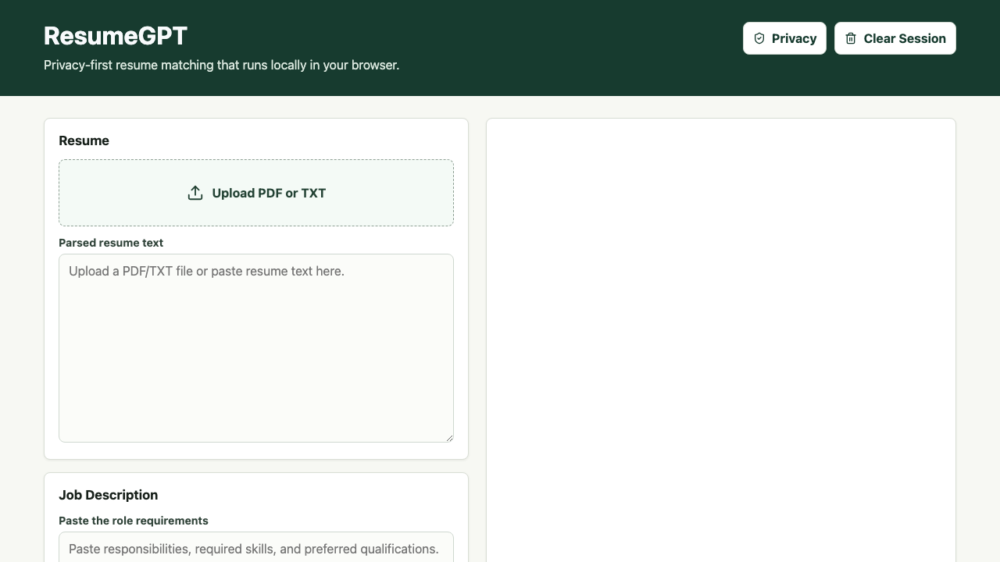
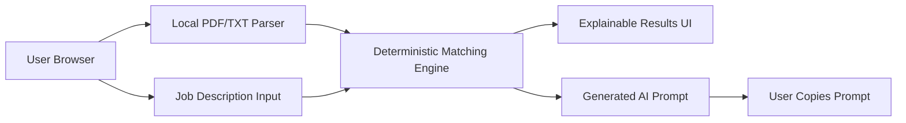

# ResumeGPT

Privacy-first resume and job-description analyzer with local skill matching and optional AI-powered feedback.



## Features

- Browser-only React + TypeScript application built with Vite.
- PDF and TXT resume parsing in the browser.
- Deterministic local matching for skills, aliases, categories, keyword coverage, missing skills, evidence, and explainable scoring.
- No ResumeGPT backend, account, database, cloud storage, or resume upload.
- Optional AI workflow that generates a structured prompt for ChatGPT or another AI service.
- No direct browser API-key mode and no application-owned AI credential.
- Clear Session action removes resume text, job description, and local analysis from memory.

## Privacy-First Design

Core analysis runs locally in browser memory. Resume files are parsed on the device and are never sent to a ResumeGPT server. The app does not persist resume data by default and never puts resume content in URLs.

Optional AI feedback is handled through a generated prompt that the user can copy into the AI service of their choice. ResumeGPT does not collect API keys or call an AI provider directly.

## How Local Analysis Works

1. The browser validates the selected PDF or TXT file by extension, MIME type where available, file size, and readable content.
2. PDF text is extracted with `pdfjs-dist`; TXT files are read with the browser `File` API.
3. The skill extractor scans the resume and job description with normalized aliases such as `k8s`/`Kubernetes`, `node`/`Node.js`/`NodeJS`, and `postgres`/`PostgreSQL`.
4. Matching uses token-aware patterns to avoid false positives such as matching `Java` inside `JavaScript`.
5. Scoring is deterministic: required job skills count 2x, preferred skills count 1.5x, and other detected job skills count 1x.

## Architecture



## Technology Stack

- React
- TypeScript
- Vite
- pdfjs-dist
- Vitest
- React Testing Library
- Playwright
- GitHub Actions
- GitHub Pages

## Local Development

```bash
npm ci
npm run dev
```

## Testing

```bash
npm run lint
npm run typecheck
npm run test:coverage
npm run build
npm run test:e2e
```

CI does not require or use an API key.

## CI/CD

`.github/workflows/ci.yml` runs linting, TypeScript checks, coverage tests, and a production build on pushes and pull requests to `main`.

`.github/workflows/deploy.yml` repeats validation, builds the static site, uploads the `dist` artifact, and deploys through the official GitHub Pages actions:

- `actions/configure-pages`
- `actions/upload-pages-artifact`
- `actions/deploy-pages`

No `gh-pages` branch is used.

## GitHub Pages Deployment

Set the repository Pages source to **GitHub Actions** in GitHub repository settings. Pushes to `main` deploy the static site, and `workflow_dispatch` can be used for manual redeployment.

## Project Status

ResumeGPT is now a static, privacy-first browser application. The former Express backend and third-party platform deployment configs have been removed.

## Suggested GitHub Metadata

Description:

> Privacy-first resume and job-description analyzer with local skill matching and optional AI-powered feedback.

Topics:

`resume`, `resume-analyzer`, `job-search`, `react`, `typescript`, `vite`, `openai`, `privacy`, `github-pages`, `github-actions`

## Contributing

Keep the project static and privacy-first. Do not add authentication, databases, cloud storage, hosted backends, serverless functions, vector databases, RAG, payments, or deployment targets other than GitHub Pages.

## License

MIT
